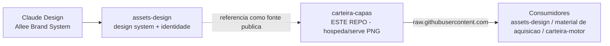

# Arquitetura — carteira-capas

**Arquitetura de execução: não se aplica.** Este repositório **não tem software**
— não há build, runtime, testes ou deploy. É um **acervo de imagens (PNG)** que o
GitHub serve por URL. O que segue é um **mapa leve**: a topologia das pastas, a
convenção de nomes e o esquema de hotlink. A identidade/marca é do
**[`assets-design`](https://github.com/allee-brazil/assets-design)** (por isso não
há `IDENTIDADE.md` aqui).

## Lugar na família



- **Arte nasce** no Claude Design → **`assets-design`** guarda regra/identidade e
  **aponta** para cá.
- **`carteira-capas` (este repo)** apenas **armazena e serve** os PNGs, público,
  por URL crua.
- **Consumidores** referenciam a capa por hotlink — sem re-upload.
- _(TODO: preencher — confirmar se o `carteira-motor` consome as capas por hotlink
  e em quais telas/etapas.)_

## Topologia das pastas

```
carteira-capas/
├─ carteiracapas/                 # 36 capas NN-slug, OTIMIZADAS (~40–50 KB) — sem espaço no nome
│  ├─ 01-portfolio.png
│  ├─ …
│  └─ 36-sistema-propostas.png
├─ carteiracapas 2/               # 36 capas NN-slug em ALTA (~150–870 KB) — NOME COM ESPAÇO (%20 na URL)
│  ├─ 01-portfolio.png … 36-sistema-propostas.png
│  ├─ carteiracapasevidencias/    # 5 capas de apoio (slug, sem número)
│  │  ├─ curva-aprendizado.png
│  │  ├─ fragmentacao-sinal.png
│  │  ├─ objetivo-sinal.png
│  │  ├─ orcamento-50-eventos.png
│  │  └─ relevancia-custo.png
│  └─ carteiracapasnovos/         # 6 capas de apoio (slug, sem número)
│     ├─ catalogo-produtos.png
│     ├─ conversoes-offline-crm.png
│     ├─ loja-commerce.png
│     ├─ publicos-personalizados.png
│     ├─ usuario-sistema-token.png
│     └─ vinculos-ativos.png
└─ carteiracapas.zip              # bundle (1,5 MB) do conjunto OTIMIZADO (as 36 de carteiracapas/)
```

Total no git: **83 PNG + 1 zip** (um único commit, `Add files via upload`).

> **Duas cópias das 36 capas** (`carteiracapas/` otimizada × `carteiracapas 2/`
> alta). Ainda **não há conjunto canônico decidido** — ver README §Atividades.

## Convenção de nomes

| Tipo | Padrão | Exemplo |
|---|---|---|
| Capa do fluxo principal | `NN-slug.png` (número = ordem 01–36) | `14-pixel.png` |
| Capa de apoio (subpasta) | `slug.png` (sem número) | `carteiracapasevidencias/curva-aprendizado.png` |

Regra: **PNG**, slug em **kebab-case** (minúsculas + hífen), **sem espaço** no
nome do arquivo. (O espaço na pasta `carteiracapas 2/` é dívida do dump inicial.)

## Esquema de hotlink

```
https://raw.githubusercontent.com/allee-brazil/carteira-capas/<ref>/<caminho>
```

- `<ref>` = `main` (última versão) **ou** commit SHA / tag (imutável).
- `<caminho>` = caminho no repo; espaços viram `%20` (`carteiracapas 2/` →
  `carteiracapas%202/`).
- Verificado: `.../main/carteiracapas/01-portfolio.png` e
  `.../main/carteiracapas%202/08-acessos-papeis.png` respondem `200 image/png`.

**Produção:** fixar **SHA** (a URL em `main` serve a arte que estiver lá no momento).

## Placeholders pendentes

No conjunto em alta (`carteiracapas 2/`), 6 capas estão como **placeholder de
~4 KB** (arte final pendente): `19-conversao-cambial`, `27-bridge-page`,
`29-perguntas-certas`, `31-pesquisa-mercado`, `32-temperatura-trafego`,
`36-sistema-propostas`. As equivalentes em `carteiracapas/` estão completas.

## Estado & fontes

- **Estado vivo:** `README.md` (§3 · Operação → Atividades).
- **Identidade / regras de arte:** `assets-design` (Allee Brand System) — este
  repo só hospeda.
- **Instruções para o Claude:** `CLAUDE.md`.
